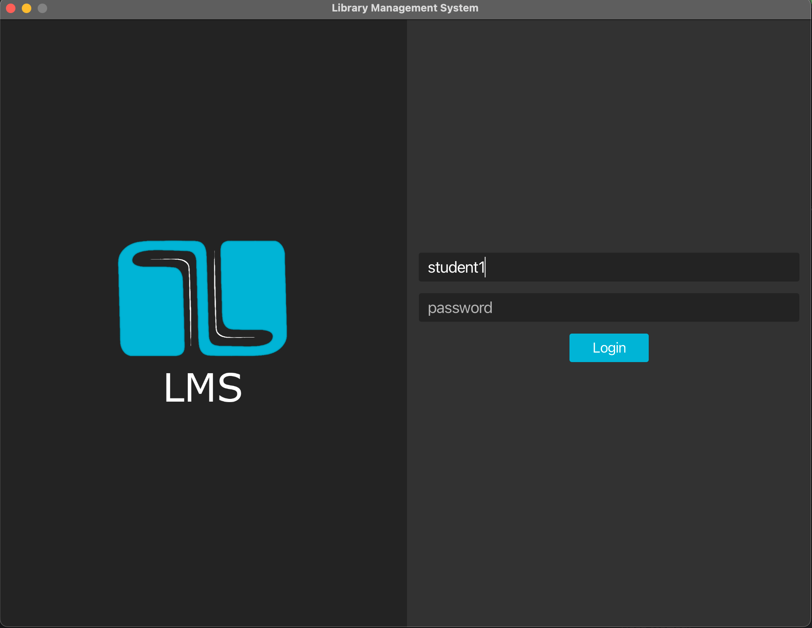
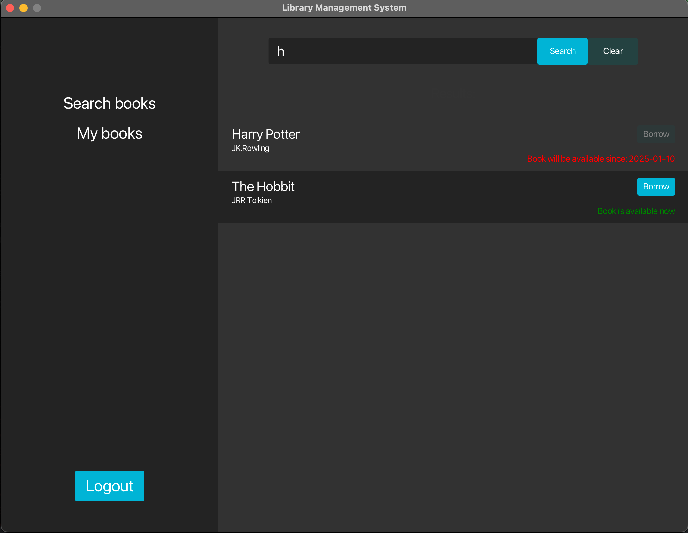
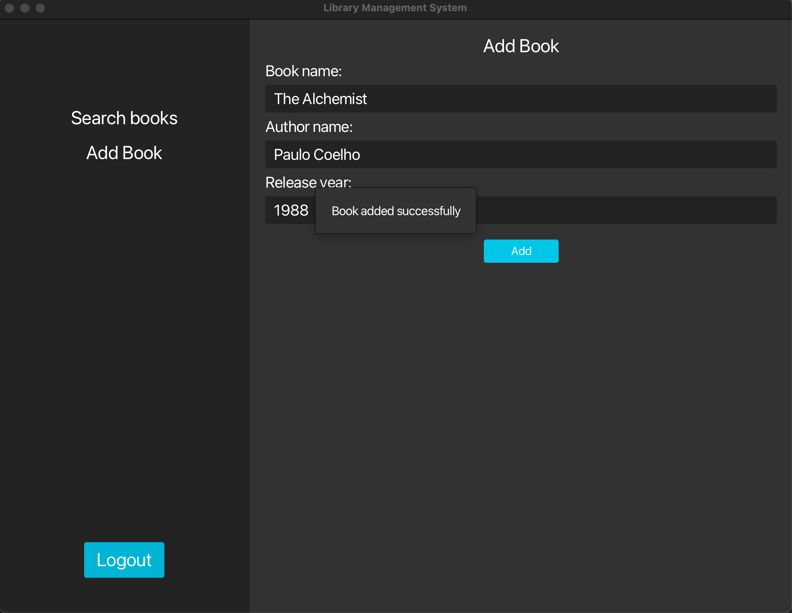

# Library Management System

## Overview

The **Library Management System** is a simple desktop application built with JavaFX that simulates the functionality of a library management system. It enables users to borrow and return books as library patrons and allows librarians to add and remove books from the catalog. The application is designed to be an intuitive and efficient tool for basic library operations.

## Features

- Borrowing and returning books.
- Adding and removing books from the library's collection.

## Potential Extensions

In the future, the application could be extended with the following features:

1. **User Management**  
   Enable user account creation and management for both patrons and librarians.

2. **Detailed Book Descriptions with Multimedia**  
   Add comprehensive book descriptions, including cover images, author biographies, and multimedia content.

3. **Enhanced Borrowing System**  
   Introduce advanced borrowing features, such as due dates, overdue notifications, and fines.

4. **Book Classification**  
   Implement categorization and tagging of books by genre, author, or subject.

5. **Report Generation**  
   Create detailed reports on borrowing trends, book availability, and user activity.

6. **User Communication**  
   Enable communication features such as email notifications, reminders, and direct messaging for patrons and librarians.

## Technologies

- **Java**  
  Core language for the application.  
- **JavaFX**  
  Framework for building the graphical user interface.  
- **CSS**  
  Used for styling the application's interface.

## Getting Started

To run the application, ensure you have the following prerequisites:

1. Install the latest version of the Java Development Kit (JDK).  
2. Download and set up JavaFX SDK.  
3. Clone the repository:  
   
   ```bash
   git clone https://github.com/bartodziej777/library-management-system
   ```

4. Open the project in an IDE with JavaFX support (e.g., IntelliJ IDEA, Eclipse).  
5. Configure the JavaFX library path in your IDE settings.  
6. Run the main class to launch the application.

## Predefined User Accounts

For testing purposes, you can log in with the following predefined account:

1. Reader account 1:
   - **Login:** student1  
   - **Password:** 1234  
2. Reader account 2:
   - **Login:** student2  
   - **Password:** qwer  
3. Librarian account 1:
   - **Login:** john  
   - **Password:** 5678  
4. Librarian account 2:
   - **Login:** mark  
   - **Password:** asdf

## Application Preview

Below are screenshots showcasing the application in action:

1. **Login screen**

   

2. **Reader dashboard when searching a book**

   

3. **Librarian dashboard when adding a book**

   

## UML Diagram

The following UML diagram provides an overview of the system's architecture:


